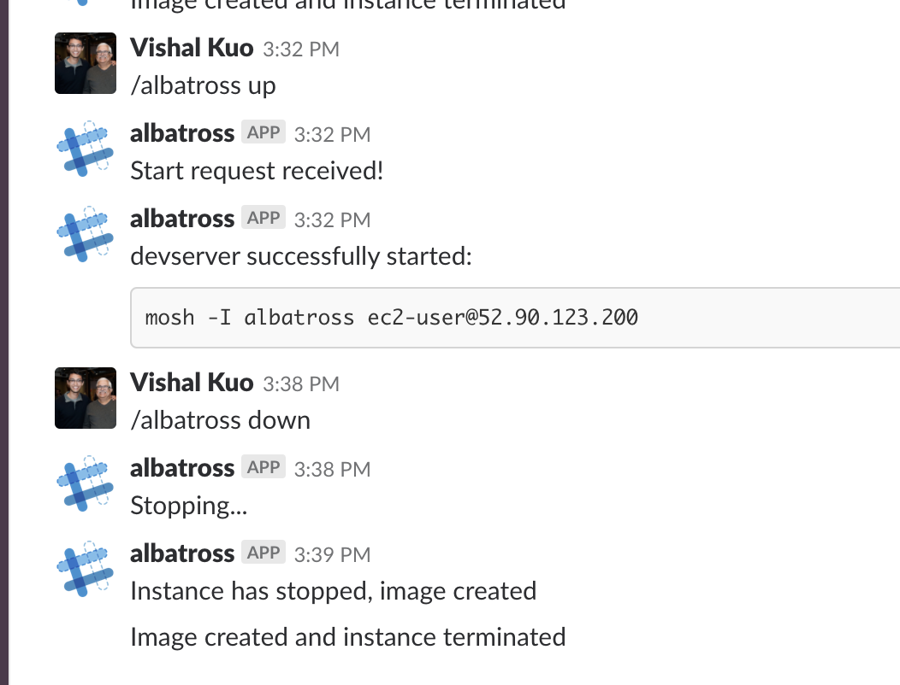

# albatross [](https://travis-ci.com/vishalkuo/albatross)

## What?

Albatross lets you manage a devserver from Slack with a couple basic slash commands. It supports spinning up a devserver from an AMI and backing a devserver up into an image to save costs.



## Why?

In my efforts to travel lightweight, I'm taking a stab at trying to develop completely from an iPad Pro. Tons of great apps exist to ssh into a remote machine (I use [Blink Shell](https://www.blink.sh/)) but managing the server itself is non-trivial.

Given the availability of Slack on most iOS and Android devices and a fairly limited server administration scope, I figured the two could be put together to achieve what I want.

## Setup

If you'd like to replicate this setup, there's a fairly involved set of steps to take:

### AWS

I've tried to recreate my setup for AWS in the `terraform` directory but it's fairly untested and there hasn't been a lot of work done around IAM roles. It's worth a shot but I make no guarantees that it works. It mostly serves as reference for now.

#### Lambda

1. We're going to need two python3.6 lambdas - `albatross` and `albatross-internal`. `albatross` should consume from an API Gateway and produce to an SNS topic. This lambda acts as the frontend for Slack to interface with but doesn't handle long running jobs or Cloudwatch Events
2. `albatross-internal` has three consumption sources:

- the same SNS topic `albatross` produces to
- a Cloudwatch scheduled event that runs every 5 minutes. This event allows albatross to poll for changes to AMI availability and to terminate an instance once the AMI has baked
- a Cloudwatch event that occurs whenever an EC2 instance transitions into the `stopped` or `running` states

### Slack

1. You'll need to create slash app in Slack: https://api.slack.com/slash-commands make sure that you save the validation token associated with your app. This app should POST to the api gateway created for `albatross`
2. You'll also need to create an incoming webhook in Slack (probably with the same app that the slash command exists with) to allow albatross to adhoc post to your workspace: https://api.slack.com/incoming-webhooks

### Environment Variables

The `albatross` lamba requires a couple environment variables to work:

```
SLACK_KEY: the validation key created from the slash command
SNS_TOPIC: the topic that `albatross` should produce to
```

The `albatross-internal` lambda also requires some environment variables:

```
KEY_NAME: the name of the ssh key to associate with your devserver
SECURITY_GROUPS: a comma separated list of security groups to associate with your server
SLACK_WEBHOOK: the webhook you'd like to post to
```

## Prior Art

Are there easier/existing ways to achieve what I want? Probably. This was created as a pet project to learn.

Doesn't this look a lot like https://github.com/vishalkuo/dove? Yes, however I chose not to continue using DigitalOcean as their API was fairly limited and managing the same workflow from Slack would've been more difficult.
